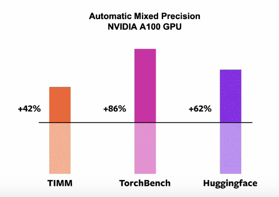

PyTorch 2.0 reference: https://pytorch.org/get-started/pytorch-2.0/
HF/TIMM reference: https://pytorch.org/blog/Accelerating-Hugging-Face-and-TIMM-models/

## PyTorch 1.14 (or rather 2.0!)

* PyTorch eager mode is not keeping up with GPU development
* For ML scientists, goal: 30% faster PyTorch with no change to the frontend code, lower memory usage

Reference models to benchmark:

**without touching the code itself**, and robust to correctness and accuracy

Some older ideas:
* kernel fusion
* torch.compile(model) to get a faster model

Issue: building a compiler without loosing usability is HARD.

Step of building a compiler:
* graph acquisition (cosntruct a graph) ==> how to capture dynamic graphs without compromising user experience? Ideas: **torch.jit.trace**, **torch.jit.script** (need to modify code), **fx tracer** (not released?), LazyTensor, torchdynamo (focus of the talk)
* graph lowering (?)
* graph compilation (map to GPU/XPU cluster)

## torchdynamo

* dynamo finds blocks that can be compiled, and those that can't be compiled.

Analyze the bytecode directly?

Internally: have been happy with torchdynamo for graph acquisition.

### How gradient is handled?

2000+ operators in pytorch!!!!
==> How to make it easier to write backends for pytorch?

Idea: build a primitive opset (smaller sample representing all ops)

* TorchDynamo: gives an ATen/Prim IR.
* TorchInductor: written a lot with OpenAI Triton, used for graph compilation. Support on CPU via GCC and LLVM, **does not work on older than Volta and Ampere**, ATM no support on AMD (but they work on it?)

Other than TorchInductor nvFuser, TensorRT, etc

As of today out of the box:

* This is on A100!!!! On other GPU the speedup is lower. The faster and bigger GPU, the more eager mode can not keep up and you need to introduce a compiler.

Introducing `torch.compile` in PyTorch, will be shipped in 1.14.

Different mode to have different compilation time, suitable e.g. for different size of models.

TorchInductor is the default backend. **dynamic shape** support.

* dynamic better than static shape + padding

* fullgraph mode for traditional compiler (e.g. TensorRT), to not have partial graphs.

* In the future: compile whole training loops for example.
* If make model faster: the communication can become a bottleneck (distributed case)

* Faster on 43% models on Aggregate bench on A100. Why only 43% of models???

In terms of user experience, it's **really new**. Call it PyTorch 2.0 ==> stable release at beginning on March 2023.

### Roadmap for 2.x

* Open to community contribution for this. Q/A webinar later in the months with devs of PyTorch.
* **Fully backward compatible.**

## Peng Wu: deep dive in torchdynamo

* Why so long for compilers in PyTorch? ==> PT loved for the reasons it's hard to compile. Took years to come at where we are

* Q: what is the one thing to change in the compiler stack that will makes things easier?
===> graph capture. Non trivial to get graphs reliably.

### in a nutshell

* partial graph capture. Skipped unwanted part of eager
* guarded graph: make sure the captured graph is correct, jit recapturing

### when to use?
For training:
* All but XLA/TPU: Dynamo
* XLA/TPU: LazyTensor

For inference: TS for embedded, non-embedded fx?? Is this currently in 1.x ?

## Jason Ansel: TorchInductor

Pytorch native. Python-first. Written in Python. Focus on breadth rather than depth early on, to capture edge cases.

Techs:
* Define-by-run loop-level IR: direct use of python functions in IR definitions (?)
* Dynamic shapes & strides: use sympy to reason about shapes, indexing
* Compiler generates **OpenAI Triton** code on GPU, C++ code on CPU.

`ops` can be overriden. Makes it easy to write a backend?

Use fx (where?)

Stack:

TorchInductor results:

On CPU:

## Michael Suo: PyTorch 2.x export path, mid/long term

### Why export?

Want ahead of time guarantees.

Operate in constraints where e.g. Python/PyTorch is not available!

Want to interoperate with a variety of backends.

### What it is

Produce a single graph out of the model. Definie the primitive operator set (smaller than the 2k+!)

torch.compile:

* Guards are attached to the partial graphs, that can be recompiled just in time

Majority of PyTorch users will be just happy with this.

But, we may want to capture the entire model as a SINGLE graph: `torch._dynamo.export(my_func, input)`

### What are we actually exporting?

2K+ operators in PyTorch. Lack basic information about them (e.g. shape propagation rules). It's historically hard to export from PyTorch.

Want to simplify ATen to ~750 ops by eliminating variants. Express compound ops as simpler ones. In the smaller opset, tensors are always contiguous?

Will simplify the task to write a backend for PyTorch.

### Primitive opset

Even smaller, with simple semantic. Explicit types? Intended for sophisticated compilers? For a backend: first support the primitive ones, and then more and more.

**Avoid everyone reinventing the wheel** with standardized IR and operator set

Stable support planned for Fall 2023?

## Horace He: dynamic shape support in PyTorch 2.0.

Want support for dynamic shapes, and it to be fast.

Why talk about it now? With compilation things become trickier.

In eager mode:
* Python --> C++ --> kernels (for each input)

in 2.0:

Reuse of the static representation.

**BUT:** all the Python/C++/kernels can depend on the shapes.

Use symbolic values for shapes? Symbolic tensors?

resnet

last shape is non trivial but known symbolically through sympy

### What about shapes due to controlflow?
* introduce guards to controlflow? A case required for the graph to be correct, and checked JIT?? Then, if not good, we know we need to retrace and recompile.

Perf results above in the intro:
* PT latency with eager grows smoothly.
* static shapes + padding: have jumps. Overhead due to the padding
* With PyTorch 2.0 and dynamic shape: smooth as eager, but faster

**Dynamic shape compilation needs to be done only once, hence saving time?**

### Beyond compilation

System to reason about symbolic shapes in PyTorch. For example: symbolically check your function, the shapes (will I result in an error?). Count FLOPS symbolically.

Contributors:

## Anjali Sridhar: PyTorch distributed: scaling workloads

Add Dynamo support for DDP? decorator as `@torch.compile()` to optimized the DDP wrapped modules.

Work on (DDP and FSDP):
* activation checkpointing
* mixed precision
* tackling oom issues

For pipeline parallelism:
* implemented PiPPy, a cross host pipeline parallelisme API to enable automatic splitting of the model using torch.fx and 2D parallelism with DDP.

Goal: automatically split/shard a model.

Tensor parallelism:
* DTensor?

* works in place

Ressources:

## Dennis van der Staay: torchrec

To author and scale recommender models.

see https://github.com/pytorch/torchrec

## Tristan Rice: torchdeploy aka multipy

Deploy eager-mode PyTorch?

Run multiple python interpreters within a single code. It is a C++ library targetting deployment on Linux x86_64

Hello world of torch::deploy:

Get a wrapped PyThon object in C++. How different is it from PyTorch C++ frontend?

No modification to the model required. Share the same model across multiple python interpreters. libtorch/aten backend is the same so no extra copies of the model required (this is cool for GPU no?)

* shared libtorch C++ but duplicate libpython?

Support for custom linked, to load arbitrary C extensions

## Ankita De: torch multimodal

e.g. visual question answering

see https://github.com/facebookresearch/multimodal

## Vincent Moens: torchrl

refer to https://github.com/pytorch/rl

## Raziel Alvarez: PyTorch support for mobile

* for offline use
* reduce response time and user perceived latency

Significant binary size reduction compared to PyTorch

At Meta: ~70B/day inference with PyTorch Mobile

Challenges:
* hardware heterogeneity
* more metrics to optimize (power consumption)
* mixed compute unit execution (e.g. DSP + NPU?)

Current approach taken by most people: create narrow solutions, leaving the original framework in which the model was authored

Issue: it increases friction due to the conversion step. Fragments the ecosystem, users have to learn different frameworks.
